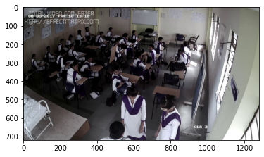
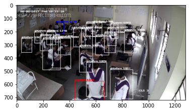

# classroom-analytics
A small project to automatically detect if a class is going on or not

* extractFrames.py - utility to extract frames from video
* summarizeImageCollection.py - utility to summarize the extracted images
* classroom.ipynb - Google Colab notebook containing all data processing, model training and inference details

  
